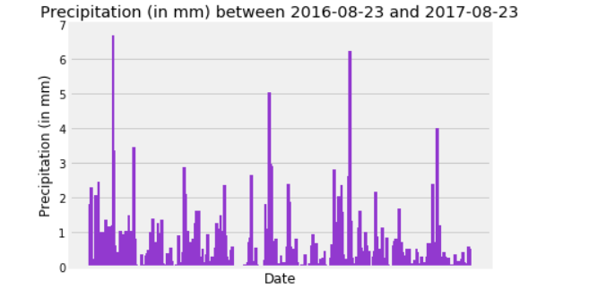
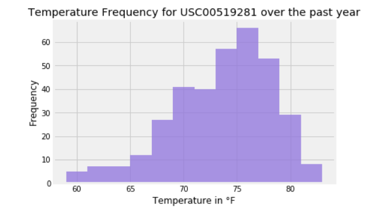
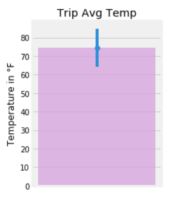
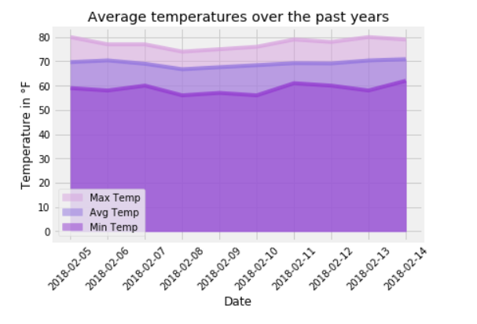

# Week 10 SQLalchemy Challenge
By A. Rijpkema 12/19/2019

In this folder you will find the results for the SQLAlchemy and Flask exercises as described for week 10.

The Jupiter notebook covers (among many things!)

Average rainfall over the last year of available data in the database:

A histogram of the frequency of average temperatures for the most active station:

 

A bonus section for graphing the average temperature, with min/max temps being defining the sem (error bar) 
Including an unpaired(! because the results are not related) independent t_test to see if theres a significant difference between summer and winter months (for example- you chose!)

 

And lastly my favorite (should anybody actually read this far :-) ):

 

WAAW!